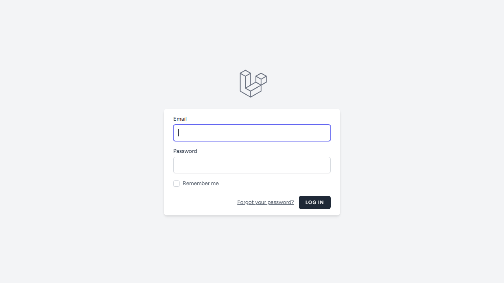
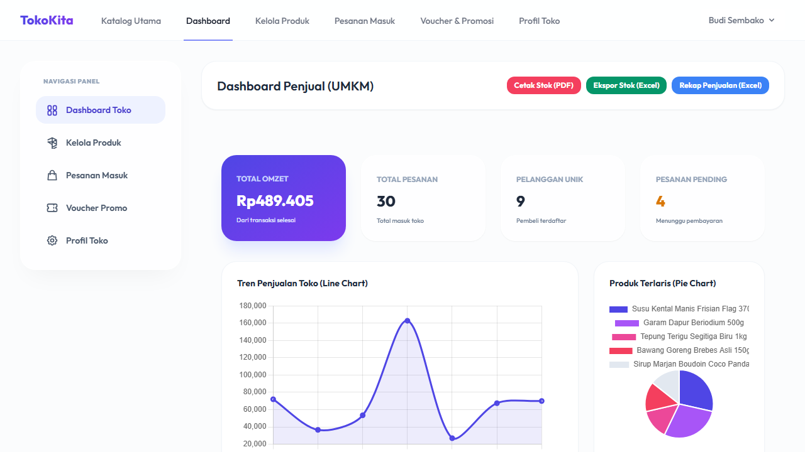
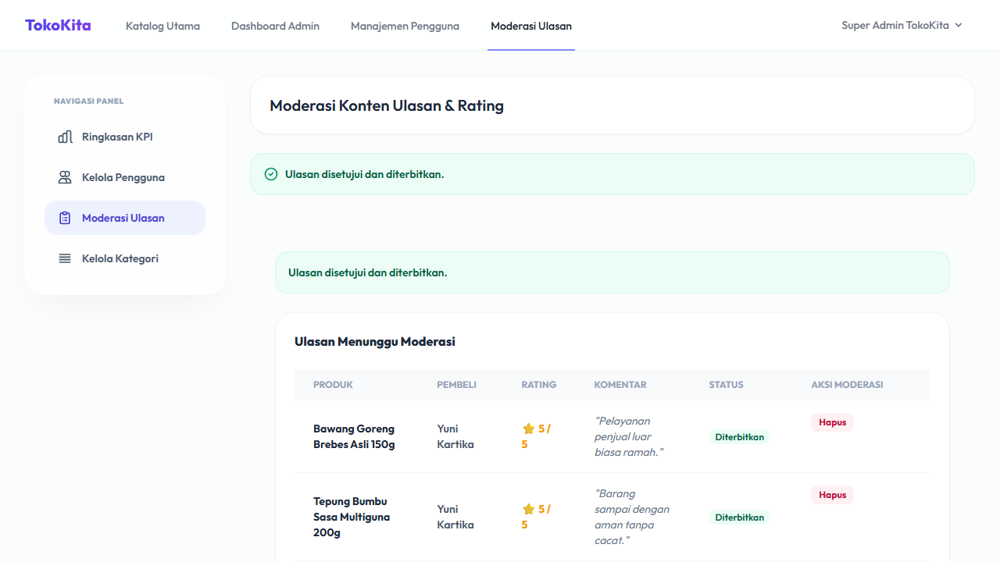
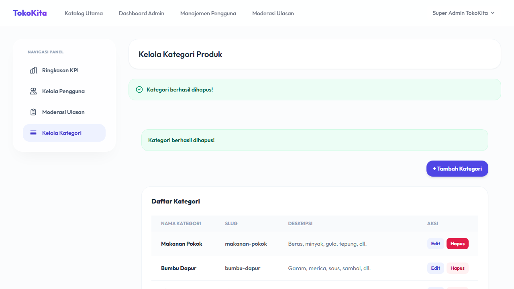

# TokoKita: Platform Marketplace E-Commerce UMKM

TokoKita adalah platform marketplace e-commerce inovatif yang dirancang khusus untuk memfasilitasi Usaha Mikro, Kecil, dan Menengah (UMKM) dalam mengelola operasional bisnis, memproses transaksi jual-beli secara transparan, serta menganalisis performa usaha melalui reporting engine multi-format yang canggih. Proyek ini dikembangkan sebagai bagian dari tugas penelitian skripsi program sarjana.

---

## 🚀 Fitur Utama

1. **Manajemen Produk & Varian (Stock Locking)**
   * Manajemen inventaris multi-varian (ukuran, warna, berat, dll.).
   * Mekanisme otomatisasi *Stock Locking* berbasis database transaction untuk menjaga konsistensi stok ketika checkout, serta pengembalian stok (stock increment) saat pesanan dibatalkan.
2. **Validasi Voucher & Promosi Berjenjang**
   * Pengecekan dinamis masa berlaku voucher, kuota pemakaian, dan minimum spending belanja dengan kalkulasi pemotongan nominal/persentase.
3. **Alur Logistik Status Dinamis**
   * Transisi status pesanan runut: `Pending` ➔ `Paid` ➔ `Processed` ➔ `Shipping` (input resi) ➔ `Completed`.
4. **Verifikasi & Rekonsiliasi Pembayaran**
   * Unggah bukti transfer bank manual oleh pembeli dan panel moderasi khusus bagi penjual untuk validasi keabsahan data transfer guna menghindari penipuan.
5. **Moderasi Konten Ulasan & Rating**
   * Filtrasi ulasan bintang 1-5 dan masukan teks pembeli oleh Admin Sistem sebelum diterbitkan ke katalog publik.
6. **Reporting Engine Multi-Format**
   * **Ekspor PDF**: Invoice Pembelian, Surat Jalan Pengiriman, dan Laporan Stok Inventaris Toko.
   * **Ekspor Excel (.xlsx)**: Laporan detail stok opname, rekapitulasi penjualan periodik, serta data pembeli loyal.
   * **Grafik Interaktif (Chart.js)**: Tren omzet penjualan periodik (Line), porsi produk terlaris (Pie), dan sebaran distribusi rating ulasan (Bar).
7. **Automated Daily Summary Scheduler**
   * Perekaman otomatis data penjualan per toko melalui scheduler yang berjalan otomatis setiap hari pukul 01:00 AM.

---

## 🛠️ Tumpukan Teknologi (Tech Stack)

* **Backend Framework**: Laravel 10 (PHP 8.2+)
* **Frontend UI**: Vanilla CSS & Tailwind CSS (Blade Components), Alpine.js (Real-time Validations)
* **Charts**: Chart.js
* **Reporting Engine**: Barryvdh DomPDF & Maatwebsite Excel 3.1
* **E2E Testing**: Playwright TypeScript
* **Database**: SQLite / MySQL

---

## 📸 Tangkapan Layar Fitur

### Halaman Login Utama


### Dashboard Penjual (KPI & Charts)


### Moderasi Ulasan & Rating (Admin)


### Kelola Kategori Produk (Admin CRUD)


---

## 💻 Langkah Instalasi

1. **Clone repositori dan masuk ke direktori proyek**:
   ```bash
   git clone <repository_url>
   cd toko-umkm-app
   ```

2. **Instal dependensi Composer (PHP)**:
   ```bash
   composer install
   ```

3. **Instal dependensi NPM (NodeJS)**:
   ```bash
   npm install
   ```

4. **Salin konfigurasi environment**:
   ```bash
   cp .env.example .env
   ```

5. **Generate Application Key**:
   ```bash
   php artisan key:generate
   ```

6. **Konfigurasi Database**:
   Sesuaikan konfigurasi database Anda di dalam berkas `.env` (secara default menggunakan MySQL `tokokita`).
   
7. **Jalankan Migrasi & Seeder Database**:
   ```bash
   php artisan migrate:fresh --seed
   ```

8. **Compile Aset Frontend**:
   ```bash
   npm run build
   ```

9. **Jalankan Aplikasi secara Lokal**:
   ```bash
   php artisan serve
   ```
   Aplikasi akan berjalan pada alamat [http://127.0.0.1:8000](http://127.0.0.1:8000).

10. **Jalankan Scheduler untuk Daily Summary**:
    ```bash
    php artisan schedule:work
    ```

---

## 🧪 Cara Menjalankan Uji Coba (E2E Testing)

Uji coba End-to-End (E2E) dijalankan menggunakan Playwright untuk memverifikasi fungsionalitas alur belanja, validasi real-time, cetak PDF, ekspor Excel, moderasi admin, serta CRUD kategori.

1. **Instal Browser Playwright**:
   ```bash
   npx playwright install chromium
   ```

2. **Bersihkan state database sebelum tes (Opsional/Sangat disarankan)**:
   ```bash
   php tests/e2e/prepare_test_order.php
   ```

3. **Jalankan Seluruh Uji Coba**:
   ```bash
   npx playwright test
   ```

4. **Jalankan Test Tertentu (Misal: Laporan PDF/Excel)**:
   ```bash
   npx playwright test report-downloads.spec.ts
   npx playwright test excel-downloads.spec.ts
   ```

---

## 👤 Informasi Penulis

* **Nama**: yerrinurrahman04
* **NIM**: 2200000001
* **Program Studi**: Teknik Informatika
* **Email Akademik**: yerriseungjo17@gmail.com
