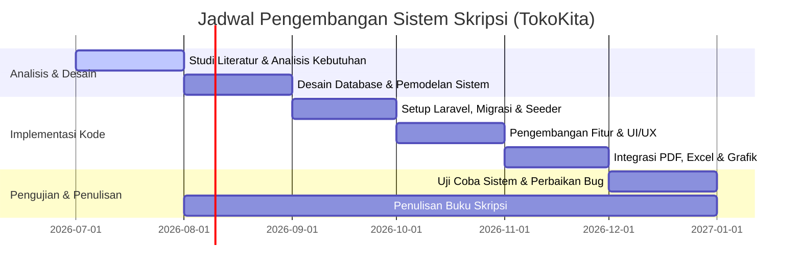

# Ruang Lingkup (Scope) Pengembangan Aplikasi "TokoKita" untuk Skripsi (1 Semester)

Dokumen ini mendefinisikan batasan, lingkup pengembangan, dan rincian fitur aplikasi **TokoKita** agar realistis dan dapat diselesaikan dalam kurun waktu satu semester akademis (sekitar 4-6 bulan). Fokus utama skripsi adalah pada integrasi modul pengelolaan transaksi yang kompleks dengan mesin pelaporan (reporting engine) multi-format.

---

## 1. Batasan Sistem & Teknis (System Constraints)

*   **Teknologi Utama**: Laravel 10 (PHP 8.2+), MySQL, Tailwind CSS, Chart.js (Frontend Charts), DomPDF (PDF Generator), dan Laravel Excel (Excel Generator).
*   **Keamanan & Autentikasi**: Autentikasi berbasis session menggunakan Laravel Breeze yang dimodifikasi untuk mendukung pembagian hak akses berdasarkan Role (Admin, Penjual, Pembeli).
*   **Metode Pembayaran**: Menggunakan metode Transfer Bank Manual dengan verifikasi manual oleh penjual melalui unggahan berkas bukti transfer (bukti struk ATM/M-Banking). Tidak mencakup integrasi Payment Gateway pihak ketiga (seperti Midtrans/Xendit) untuk meminimalisasi kompleksitas API eksternal dan biaya sandbox.
*   **Pengiriman**: Estimasi ongkos kirim menggunakan data tarif statis yang dikelola sistem internal berdasarkan pilihan kurir (bukan API RajaOngkir langsung).

---

## 2. Modul Pengelolaan Utama (Sufficiently Complex)

Scope fungsional skripsi difokuskan pada lima modul inti yang saling terintegrasi:

### A. Modul Inventaris & Varian Produk Terintegrasi
*   Pencatatan produk dengan opsi varian harga dan stok (contoh: Ukuran/Warna/Berat).
*   **Fitur Kompleks**: Mekanisme *Stock Locking*. Ketika pembeli membuat pesanan, sistem secara otomatis mengunci (mengurangi) stok utama atau stok varian. Jika pesanan dibatalkan atau ditolak, sistem mengembalikan stok tersebut ke kondisi semula secara otomatis melalui database transaction.

### B. Modul Validasi Voucher & Promosi Berjenjang
*   Mekanisme validasi kode promo secara dinamis di keranjang belanja.
*   Pengecekan kompleks mencakup:
    *   Batas masa berlaku voucher (dimulai dan berakhir).
    *   Validitas ambang batas minimum pembelanjaan (minimum spend).
    *   Kalkulasi pemotongan harga (nominal tetap atau persentase).

### C. Modul Transaksi & Alur Logistik Status Dinamis
*   Pembeli dapat memilih metode pengiriman (kurir) beserta biaya pengirimannya.
*   Penjual memproses pesanan melalui alur status: `Pending` ➔ `Paid` ➔ `Processed` ➔ `Shipping` (input nomor resi pelacakan) ➔ `Completed`.
*   Fasilitas pembatalan (Cancel) dan retur barang (Return) untuk meminimalkan kerugian transaksi.

### D. Modul Verifikasi & Rekonsiliasi Pembayaran
*   Pembeli mengunggah bukti bayar secara instan setelah melakukan pesanan.
*   Penjual melakukan verifikasi data transfer (jumlah nominal + kecocokan struk) untuk mengubah status order menjadi `Paid` guna menghindari penipuan transaksi.

### E. Modul Moderasi Konten Ulasan & Rating
*   Pembeli yang telah menyelesaikan transaksi dapat memberikan ulasan (rating 1-5 bintang + ulasan teks).
*   **Fitur Kompleks**: Ulasan tidak langsung tampil di katalog publik sebelum disetujui (Approved) oleh Admin Sistem pada panel moderasi khusus.

---

## 3. Daftar 10 Jenis Laporan & Format Terintegrasi

Untuk memenuhi prasyarat pelaporan ilmiah, aplikasi menyajikan 10 format pelaporan yang terbagi dalam 4 kategori output:

| No | Nama Laporan | Format Output | Peran Pengguna | Tujuan & Deskripsi |
| :-: | :--- | :-: | :-: | :--- |
| **1** | **Invoice Pembelian** | PDF | Pembeli & Penjual | Bukti tagihan sah transaksi pembelian produk (berisi detail harga, diskon voucher, ongkir, dan info bayar). |
| **2** | **Surat Jalan Pengiriman** | PDF | Penjual & Kurir | Dokumen pengantar barang untuk kurir ekspedisi (berisi alamat tujuan, detail kuantitas barang, tanpa mencantumkan nominal harga). |
| **3** | **Laporan Stok & Varian Produk** | PDF | Penjual & Admin | Rekapitulasi kondisi stok barang secara berkala untuk keperluan cetak cepat / arsip cetak. |
| **4** | **Laporan Inventaris Lengkap** | Excel (.xlsx) | Penjual & Admin | Audit data produk secara detail beserta relasi kategori dan ketersediaan varian produk untuk keperluan stok opname. |
| **5** | **Rekap Penjualan Harian/Mingguan** | Excel (.xlsx) | Penjual | Laporan keuangan transaksi sukses per hari/minggu untuk kebutuhan pencatatan pembukuan UMKM. |
| **6** | **Ekspor Data Pelanggan & Pesanan** | Excel (.xlsx) | Penjual & Admin | Data riwayat pembeli beserta alamat untuk kebutuhan analisis demografi pembeli loyal. |
| **7** | **Tren Omzet Penjualan Periodik** | Grafik (Line) | Penjual & Admin | Grafik garis Chart.js untuk menganalisis kenaikan atau penurunan pendapatan harian/bulanan. |
| **8** | **Produk Terlaris (Best Seller)** | Grafik (Pie) | Penjual & Admin | Grafik lingkaran Chart.js untuk memantau produk yang paling banyak dibeli guna mengatur ulang stok produk prioritas. |
| **9** | **Distribusi Rating & Ulasan** | Grafik (Bar) | Penjual & Admin | Grafik batang Chart.js untuk menganalisis kepuasan pelanggan berdasarkan proporsi bintang 1 hingga 5 yang didapatkan produk. |
| **10**| **Ringkasan KPI Real-Time** | Dashboard | Admin & Penjual | Halaman muka dashboard dinamis yang menyajikan angka total omzet, total pesanan aktif, total buyer, dan alarm stok kritis secara real-time. |

---

## 4. Rencana Jadwal Pengerjaan (Timeline 1 Semester)

Pengerjaan skripsi dibagi ke dalam beberapa tahapan utama:

